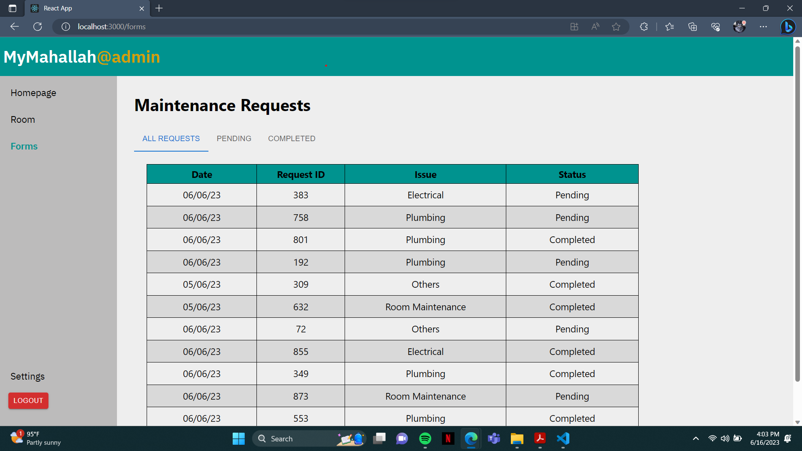

# MyMahallah@admin

## Project Overview
MyMahallah@admin is an extension of the MyMahallah project, serving as the administrative web application tailored to cater to the needs of the Mahallah Office Staffs to conduct mahallah related operations to provide a more efficient and streamlined workflow. It is specifically developed to provide administrative features and functionalities to manage student accommodations and process maintenance service requests.

## Key Features
1. User Management: Empowers administrative staff to oversee and manage student information.
2. Room Management: Facilitates the allocation and management of rooms, including resident details and key collection statuses.
3. Maintenance Requests: Provides a dashboard to track, address, and manage maintenance requests submitted by students.
4. Announcement Posting: Allows staff to disseminate crucial announcements visible to students through the MyMahallah mobile app.
5. **Settings and Configurations: Offers options to fine-tune system settings and configurations for optimal operations.

## Technologies Used
ReactJs, Firebase

- Frontend: React.js
- Backend: Spring Boot
- Database: PostgreSql
- Authentication & Authorization: JWT (JSON Web Tokens)

## Interface
### Homepage

### Room Management page

 

### Maintenance Request Management page

 

### Settings page
